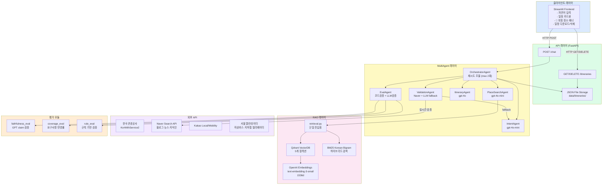
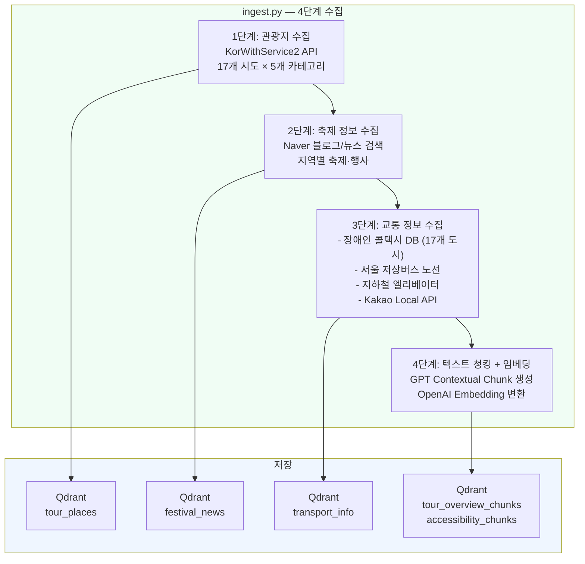
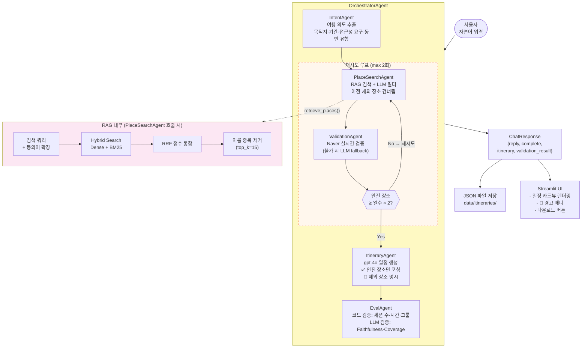
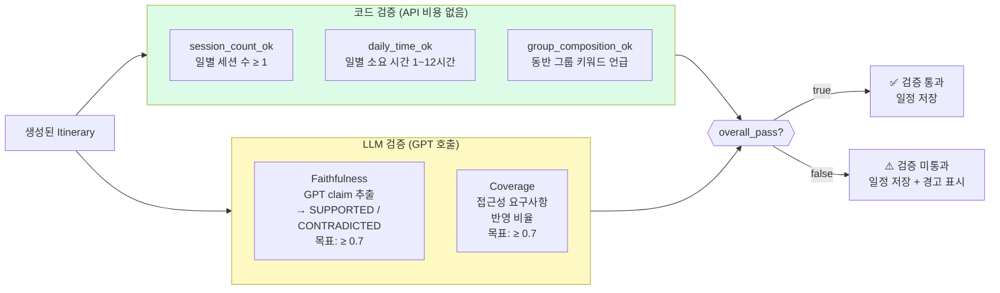

# 배리어프리 여행 플래너 — 프로젝트 산출물

---

## 1. 문제정의

### 배경

국내 교통약자(휠체어 이용자, 노인, 영유아 동반 가족 등)는 여행 계획 시 접근성 정보를 얻기 위해 수십 개의 공공 데이터 포털, 관광지 공식 홈페이지, 블로그 후기를 직접 확인해야 한다. 한국관광공사 API는 관광지 기본 정보를 제공하지만 접근성 필드는 대부분 비어 있거나 부정확하다.

### 핵심 문제

| 문제 | 설명 |
|------|------|
| **정보 분산** | 접근성 정보가 공공 API, 블로그, SNS, 지자체 홈페이지 등에 분산 |
| **최신성 부족** | 공공 데이터의 접근성 항목은 수년간 갱신되지 않는 경우 다수 |
| **개인화 부재** | 휠체어 사용자, 시각장애인, 유모차 동반 등 요구사항이 다름에도 일괄 제공 |
| **일정 통합 불가** | 접근성 정보와 여행 일정 생성이 분리되어 수동 조합 필요 |
| **신뢰성 검증 불가** | 제공된 정보가 실제 방문 시 맞는지 사전 확인 수단 없음 |

### 목표

교통약자가 자연어로 여행 조건을 입력하면 → 접근성 검증이 완료된 장소만으로 구성된 맞춤 일정을 자동 생성하는 AI 시스템 구축

---

## 2. 해결방안

### 접근 전략

**RAG(Retrieval-Augmented Generation) + MultiAgent 파이프라인**을 결합하여 최신 접근성 정보 기반의 신뢰 가능한 일정을 생성한다.

#### 2-1. 데이터 수집 및 인덱싱

- **한국관광공사 KorWithService2 API**: 전국 17개 시도 × 5개 카테고리(관광지·문화시설·축제·숙박·음식점) 크롤링
- **Naver 블로그/뉴스/지식인**: 각 장소별 최신 실사용자 후기에서 접근성 사실 추출
- **서울 열린데이터광장**: 저상버스 노선, 지하철 엘리베이터 위치
- **전국 17개 도시 장애인 콜택시 DB**: 정적 데이터베이스로 내장
- **Kakao Local/Mobility API**: 주변 교통수단, 경로 정보

수집된 데이터는 GPT로 문서 수준 맥락을 생성(Contextual Embedding) 후 Qdrant 벡터 DB에 5개 컬렉션으로 저장한다.

#### 2-2. MultiAgent 구조

| 에이전트 | 역할 |
|----------|------|
| `IntentAgent` | 사용자 메시지 → 구조화된 여행 의도 추출 (목적지, 기간, 접근성 요구사항, 동반 유형) |
| `PlaceSearchAgent` | RAG 검색으로 후보 장소 수집, 이미 제외된 장소 필터링 |
| `ValidationAgent` | Naver 실시간 검색 or LLM fallback으로 각 장소 접근성 실제 검증 |
| `ItineraryAgent` | 검증 통과 장소만으로 GPT-4o 기반 일정 생성 |
| `EvalAgent` | 생성 일정의 품질 평가 (코드 검증 + LLM 평가) |
| `OrchestratorAgent` | 전체 파이프라인 조율, 안전 장소 부족 시 최대 2회 재검색 |

#### 2-3. 실시간 접근성 검증

Naver 블로그/뉴스/지식인 API로 해당 장소의 최신 후기를 수집한 뒤, GPT가 접근성 사실(입구 단차, 휠체어 이용 가능 여부, 장애인 화장실 유무 등)을 추론한다. Naver API 미연결 시 LLM이 장소 메타데이터 기반 fallback 검증을 수행한다.

#### 2-4. 품질 평가

- **코드 검증** (API 비용 없음): 세션 수, 일일 소요 시간 범위, 동반 그룹 키워드 언급
- **LLM 검증** (GPT 호출): Faithfulness(답변이 증거에 근거하는 비율), Coverage(접근성 요구사항 반영 비율)

---

## 3. 트레이드오프

### 3-1. SingleAgent vs MultiAgent

| 항목 | SingleAgent (05) | MultiAgent (06) |
|------|-----------------|-----------------|
| **복잡도** | 낮음 — 단일 ReAct 루프 | 높음 — 에이전트 간 인터페이스 설계 필요 |
| **디버깅** | 어려움 — 실패 지점 특정 곤란 | 쉬움 — 각 에이전트 로그 분리 |
| **재시도 제어** | 불가 — 루프 내 암묵적 처리 | 가능 — Orchestrator가 명시적 재시도 |
| **검증 통합** | 없음 — 스텁 함수로 대체 | 실제 Naver API + LLM fallback |
| **API 비용** | 낮음 (단순 루프) | 높음 (에이전트별 GPT 호출) |
| **확장성** | 낮음 — 새 기능 = 전체 수정 | 높음 — 에이전트 단위 교체 가능 |

**선택 이유**: 접근성 검증이 핵심 기능이므로 검증 실패 재시도, 검증 결과 이력 관리가 필수 → MultiAgent 채택

### 3-2. RAG vs 순수 웹 검색

| 항목 | RAG (Qdrant) | 순수 웹 검색 (Naver/Google) |
|------|-------------|--------------------------|
| **응답 속도** | 빠름 (벡터 검색 < 100ms) | 느림 (HTTP 왕복 + 파싱) |
| **비용** | 초기 인덱싱 비용 | API 호출 횟수 비용 |
| **최신성** | 인덱싱 시점에 종속 | 실시간 |
| **접근성 특화** | Contextual Embedding으로 접근성 문서에 특화 | 일반 검색 노이즈 포함 |

**선택**: RAG로 1차 후보 수집 + Naver 실시간으로 검증 (2단계 하이브리드)

### 3-3. 하이브리드 검색 (Dense + BM25) vs Dense Only

- Dense만 사용 시: "엘리베이터", "경사로" 등 정확한 키워드 검색이 약함
- BM25 추가 시: 정확한 용어 매칭 + 의미 검색 조합으로 재현율 향상
- 단점: 한국어 형태소 분석기 미설치 환경에서 character bigram 방식으로 fallback → 복합어 분리 정밀도 저하

### 3-4. GPT-4o vs GPT-4o-mini

| 에이전트 | 모델 | 이유 |
|----------|------|------|
| IntentAgent | gpt-4o-mini | 구조화 추출 — 고성능 불필요 |
| PlaceSearchAgent | gpt-4o-mini | 목록 필터링 — 단순 |
| ValidationAgent | gpt-4o-mini | 이진 판단 |
| ItineraryAgent | gpt-4o | 창의적 일정 구성, 한국어 품질 |
| EvalAgent (LLM checks) | gpt-4o-mini | 채점 — 정밀도보다 속도 우선 |

### 3-5. JSON 파일 스토리지 vs DB

- 현재: JSON 파일(`data/itineraries/`) — 단일 서버 배포 환경에서 충분, 의존성 최소
- 한계: 다중 인스턴스 배포 시 동시성 문제, 대용량 이력 조회 성능 저하
- 개선 방향: SQLite → PostgreSQL 전환 경로 확보 (CRUD 레이어 분리로 교체 용이)

---

## 4. 시스템 아키텍처

### 컬렉션 구조 (Qdrant)

| 컬렉션 | 내용 | 검색 방식 |
|--------|------|-----------|
| `tour_places` | 관광지·음식점·숙박 기본 정보 | Dense |
| `tour_overview_chunks` | GPT Contextual Chunking 청크 | Dense + BM25 Hybrid |
| `accessibility_chunks` | 접근성 특화 청크 | Dense + BM25 Hybrid |
| `transport_info` | 교통 접근성 정보 | Dense |
| `festival_news` | 축제·행사 정보 (Naver) | Dense |

---

## 5. 파이프라인

### 5-1. 데이터 인덱싱 파이프라인

### 5-2. 쿼리·응답 파이프라인

### 5-3. 평가 파이프라인

